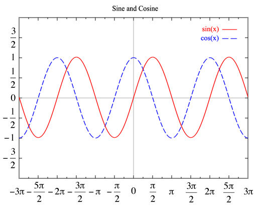

#+TITLE: My research about Digital-to-analog converter

** Links

 - https://easytechsolver.com/do-usb-dacs-have-latency/
 - https://intl.presonus.com/blogs/technical/digital-audio-latency-explained
 - https://gitlab.freedesktop.org/pipewire/pipewire/-/wikis/FAQ#pipewire-buffering-explained
 - https://www.ooberpad.com/blogs/audio-video-tips/what-is-sampling-rate-sample-depth-and-audio-sampling-in-audio
 - https://en.wikipedia.org/wiki/Sine_wave
 - https://en.wikipedia.org/wiki/Fourier_transform
   
** Notes

- *Command*: /pw-top/: The pw-top program probvides a dynamic real-time view of the pipewire node and device statistics.
- The term /sinusoidal/ is used to describe a curve, referred to go as a sine wave or a sinusoid, that exhibits smooth, periodic oscillation. Sinusoids occur often in math, physics, engineering, signal processing and many other areas.
  #+ATTR_ORG: :width 500 :align center
  
- 

*** Sample Rante and Bit rate
- 
